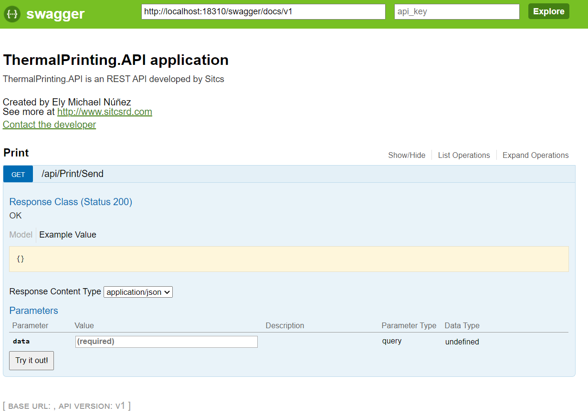

# ThermalPrint
This project allows you to print an invoice after receive a JSON document.
## Functionality
The Web API was developed in **.Net framework 4.6.1** with cors support to allow other applications execute itspublic function **send** in the printcontroller without any issue. The main idea is call it using the localhost address.

To see the configuration, goto `<remoteaddress>`/swagger/ to see the functions.



### Example
```json
{
"company":{
"CompanyID":1,
"Name":"Facultad de Odontologia",
"data":{
"address":"Calle Cristóbal de Llerenas, Campus Alma Mater, Zona Universitaria.",
"phone":"(809) 535-8274 ext. 3184",
"contact":"Angel Nadal",
"rnc":"00117292896",
"companyGroupID":1
}
},
"sales":{
"salesOrderControlID":21,
"userID":1,
"companyID":1,
"patientID":3,
"totalAmount":300,
"quantity":3,
"statusId":"P",
"data":{
"invoiceid":"3u8g5yrll4kb6m4ynw",
"payments":{
"taxreceiptnumbertype":"00",
"details":[
{
"payment":{
"amount":300,
"paymentmethod":{
"value":"E",
"text":"Efectivo"
}
}
}
]
},
"items":[
{
"productID":19,
"name":"Equilibración de oclusión",
"price":"100",
"description":"Equilibración de oclusión",
"quantity":3,
"itbis":0
}
],
"customer":{
"id":3,
"rnc":"076-45784575-4",
"name":"Ramón Del Orbe"
},
"batch":{
"id":1,
"name":"Caja 01"
},
"cashier":{
"name":"Ely Michael Núñez De la Rosa"
}
}
}
}
```
## Fix Errors in the web API.
In some computers we can receive an error related to access permissions Error writing file report: Access to the path 'c:\windows\system32\inetsrv\Ofidental\202006081051084_c62928f-aec5-4344-8081-4453ebf573fe.txt' is denied., please validate the ApplicationHost.Config will have the following configuration to access to the user profile:

`<applicationPoolDefaults managedRuntimeVersion="v4.0">
  <processModel identityType="ApplicationPoolIdentity" loadUserProfile="true" setProfileEnvironment="true" />
</applicationPoolDefaults>`

Location: C:\Windows\System32\inetsrv\config\applicationHost.config
